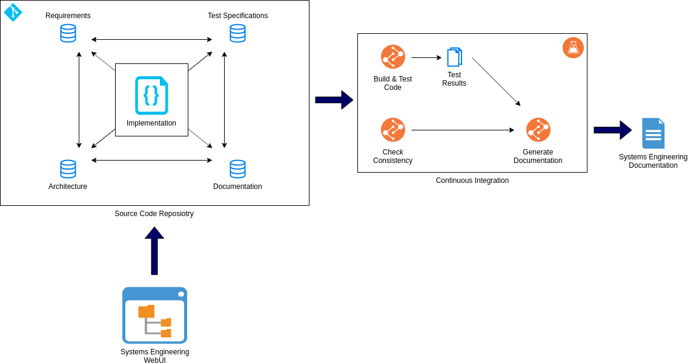

# Software-Engineering-as-Code

Model complex software systems with a textual representation next to the code using Git for version control and persistency.  

# Motivation

Software engineering is a discipline to design software systems from requirements engineering and test specification over architecture down to the implementation and documentation of the individual building blocks (e.g. software comonents).
Different tools exist to model the artifacts of the involved engineering stages, typically with a central database for persistency, access and version control.
This project takes a different approach to keep the software engineering artifacts in a textual representation close to the code and provide advanced web-based and CI-based tooling to ease the use.

# Features

The currently supported artifacts are:

- Requirements

Planned artifacts for the future are:

- Test Specification
- Software Architecture
- Roadmap
- Design Decisions
- Risks
- Domain Language / Glossary

It is also planned for future releases to introduce a markup language to write documentation with a specific syntax to refer to the software engineering artifacts.

# Documentation

This section explains the concepts and supported artifact types in detail.

## Concept

Every artifact is fully described with a textual representation, currently JSON.

## Identification of Artifacts

Each artifact has a human-readable entity ID composed of three parts:

- Type
- Sequence Number
- Short Name

The ID serves the purpose to uniquely identify the artifact.

> **_NOTE:_**  This ID may be changed, but it is advisable to not change it. In the future, there will be tooling to change the IDs.

| Attribute Name    |    Type    | Description                                                                                     |
| ----------------- | :--------: | ----------------------------------------------------------------------------------------------- |
| `type`            | enum [req] | The type of the entity.                                                                         |
| `sequence_number` |   number   | An increasing number for the artifact to discriminate it from other artifacts of the same type. |
| `short_name`      |   string   | A short description for the artifact. Expected format: [a-zA-Z][a-zA-Z0-9_].                    |

## Requirements

Requirements are modeled following an extended SysML specification. 
Each requirement has the following attributes:

| Attribute Name |            Type            | Description                                |
| -------------- | :------------------------: | ------------------------------------------ |
| `id`           |          EntityId          | The Id of the requirement.                 |
| `summary`      |           string           | A short summary of the requirement.        |
| `details`      |           string           | A detailed description of the requirement. |
| `owner`        |           string           | The owner of the requirement.              |
| `source`       | enum[stakeholder,internal] | The stakeholder for this requirement.      |
| `tags`         |        list[String]        | A list of tags to group requirements.      |

### Links

According to SysML, requirements may be linked to another. Currently supported are the relationships:

- Containment: a requirement is contained within another (parent) requirement.
- Derivation: a requirement is derived from another (source) requirement.

The relationships have the following attributes:

| Attribute      |   Type   | Description                                  | Cardinality |
| -------------- | :------: | -------------------------------------------- | :---------: |
| `contained_in` | EntityId | The *optional* ID of the parent requirement. |     1:1     |
| `derived_form` | EntityId | The *optional* ID of the source requirement. |     1:1     |

### Example Requirement

    {
        "id": {
            "type": "req",
            "sequence_number": 0,
            "short_name": "test"
        },
        "summary": "summary",
        "details": "details",
        "owner": "owner",
        "source": "stakeholder",
        "tags": [],
        "contained_in": {
            "type": "req",
            "sequence_number": 1,
            "short_name": "parent"
        }
        "derived_from": {
            "type": "req",
            "sequence_number": 2,
            "short_name": "source"
        }
    }
``