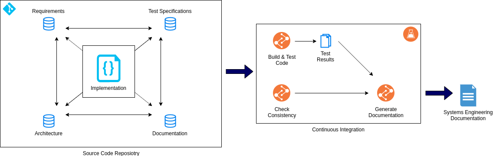

# Software-Engineering-as-Code

Model complex software systems with a textual representation next to the code using Git for version control and persistency.  

# Motivation

Software engineering is a discipline to design software systems from requirements engineering and test specification over architecture down to the implementation and documentation of the individual building blocks (e.g. software comonents).
Different tools exist to model the artifacts of the involved engineering stages, typically with a central database for persistency, access and version control.
This project takes a different approach to keep the software engineering artifacts in a textual representation close to the code and provide advanced CI-based tooling to ease the use.

# Approach

This project takes a holistic approach to have a single tool (or ecosystem) for the whole software engineering documentation process.
Following the waterfall model, it will support the artifacts:

- Requirements
- Test specifications
- Software architecture (incl. detailed design and design decisions)
- Linkage between requirements, test specifications and architectural elements
- Software documentation
- Domain language (aka. glossary)

These artifacts get backed by a markup language to write documentation with a specific syntax to refer to the software engineering artifacts.

# Documentation

The full documentation is available at: <url>

# How-to Contribute

**SWAC** is currently in an early development and evaluation phase.
Contributions are welcome in terms of code contributions, conceptual feedback ("the idea is bulls**t is also a highly valued feedback if good arguments are given) and additional ideas.