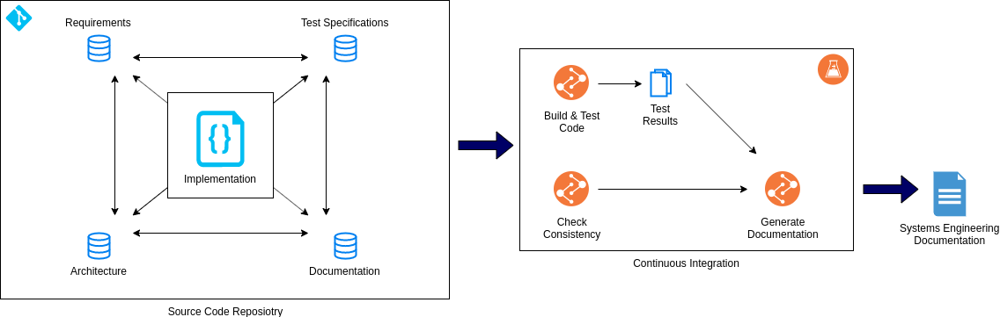

# Introduction

Software engineering is a discipline to design software systems from requirements engineering and test specification over architecture down to the implementation and documentation of the individual building blocks (e.g. software comonents).
Different tools exist to model the artifacts of the involved engineering stages, typically with a central database for persistency, access and version control.
This project takes a different approach to keep the software engineering artifacts in a textual representation close to the code and provide advanced CI-based tooling to ease the use.

